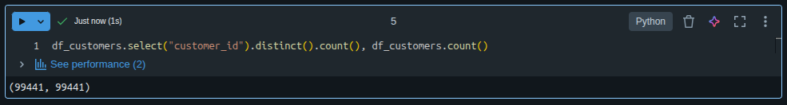
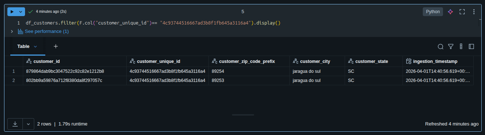
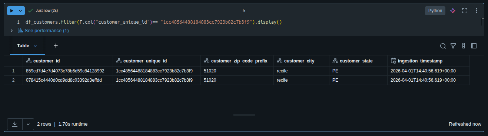
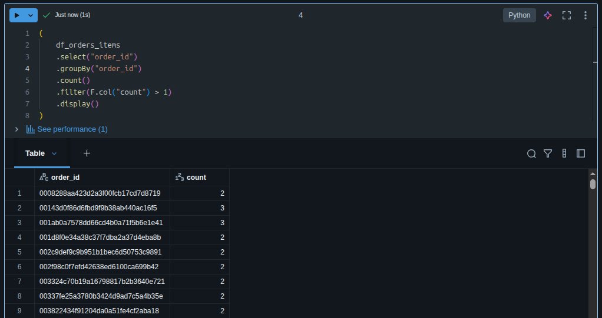
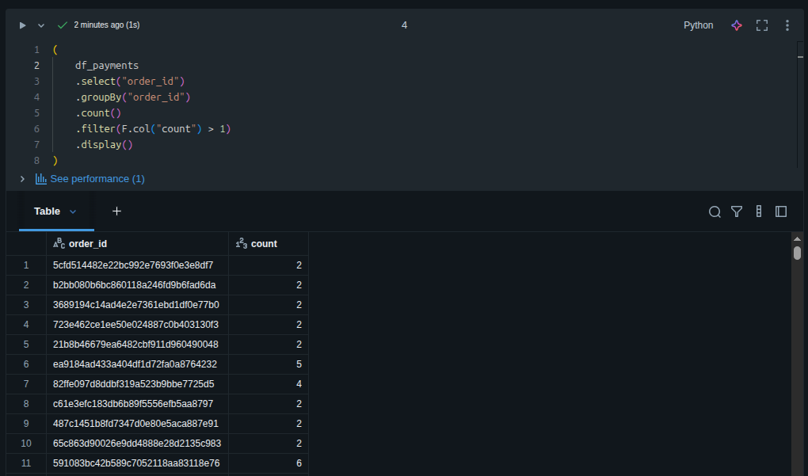
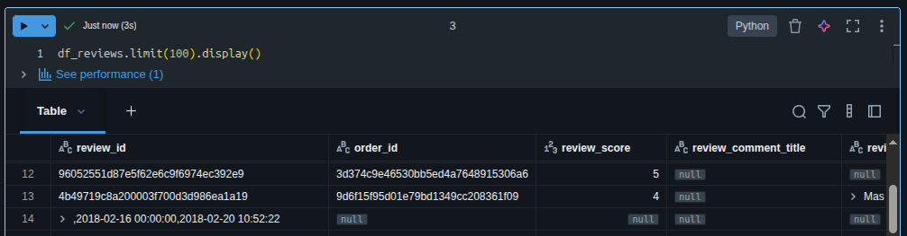
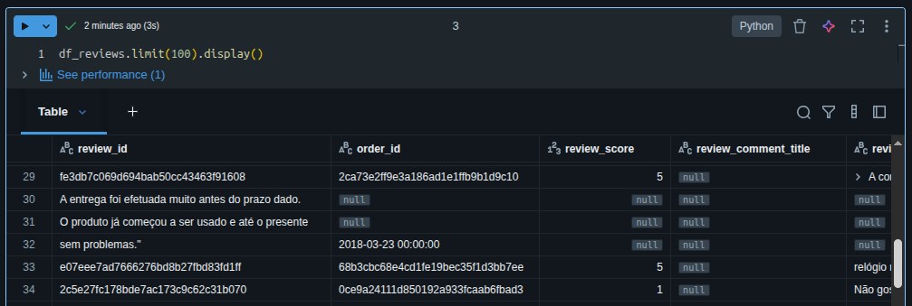
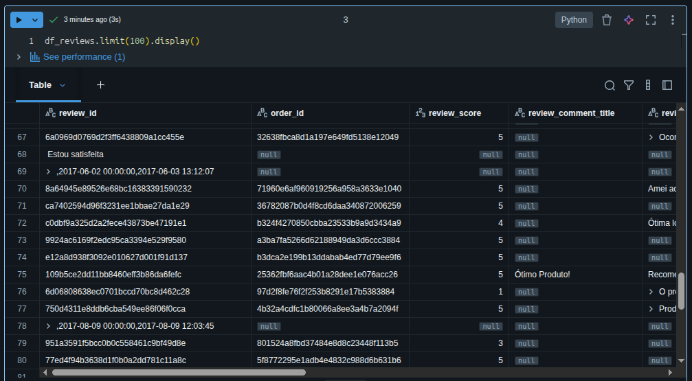

# Detalhamento de transformações!
### Regras gerais (negócio)
Atendendo requisitos da regra de negócio e manter a autenticidade dos dados, algumas regras foram implementas, nas quais são:
- Removido registros nulos nas colunas "order_id" e "customer_id" (Orders/Pedidos)
- Removido dados duplicados na colua "order_id".
- Filtrado os dados que apenas possuem os status "delivered" e "shipped"
- Unificado as tabelas orders, order_items, customers, products e sellers (Utilizando o conceito de BigTable)

### Tabela: customers
- Em: df_customers = spark.read.table("workspace.bronze_prd.customers") foi efetuado o filtro para identificar se havia dados nulos ou duplicados, porém não foi detectado na fonte atua, mesmo assim o código está prepado para que caso aconteça possa ser tratado.
Não há dados duplicados no momento.

- Existem id's duplicados na coluna "customer_unique_id", abaixo exemplo de um caso, onde muda apenas o prefixo do CEP do cliente. É necessário manter este histórico?

- No caso abaixo o "customer_unique_id", também está duplicado, porém o "customer_id", não se repete, necessário validar a autenticidade.

Até o momento, os dados duplicados da coluna "customer_unique_id", serão mantidos pois a regra de negócio exige apenas a remoção dos dados duplicados na coluna "customer_id". A área de negócios será acionada sobre o caso.

## Tabela: orders
Coluna order_approved_at possui 160 valores nulos

Coluna order_delivered_carrier_date possui 1783 valores nulos

Coluna order_delivered_customer_date possui 2965 valores nulos

Não há dados duplicados nas principais colunas

## Tabela: order_items
- Não possui dados nulos
- Há dados duplicados na coluna "order_id" que serão deletados.
Amostra simples de dados duplicados:

## Tabela: payments
- Não possui dados nulos
- Há dados duplicados na coluna: "order_id" e serão removidos.
Amostra simples de dados duplicados:

## Tabela: review - problemas críticos
Coluna review_id possui 1 valores nulos

Coluna order_id possui 2236 valores nulos

Coluna review_score possui 4937 valores nulos

Coluna review_comment_title possui 92157 valores nulos

Coluna review_comment_message possui 63079 valores nulos

Coluna review_creation_date possui 8832 valores nulos

Coluna review_answer_timestamp possui 8785 valores nulos

Há "descolunamento" nos dados causando inconsistência nos dados, vide print abaixo.
Dados não consistentes na coluna "review_id"

